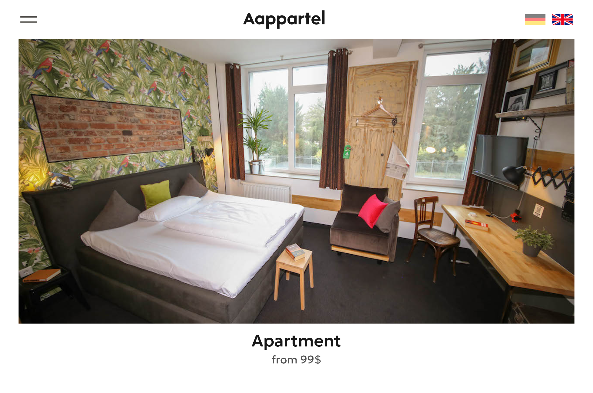

  <h2>Aappartel</h2>
  

## Содержание
1. [Описание](#описание)
2. [Функции](#функции)
3. [Особенности](#особенности)

## Описание
Это сайт для заказчика, в котором можно бронировать апартаменты.
Данная ветка main включает в себя весь исходный код сайта.

## Функции
- Просмотр картинок апартаментов по нажатию на соответствующий тип апартаментов.
- Просмотр описаний различных сервисов с помощью листалки типа "карусель".

## Особенности
- Отображение местоположения офиса на карте Google прямо на сайте
- Приятная цветовая гамма.
- Возможность отправки письма по email.